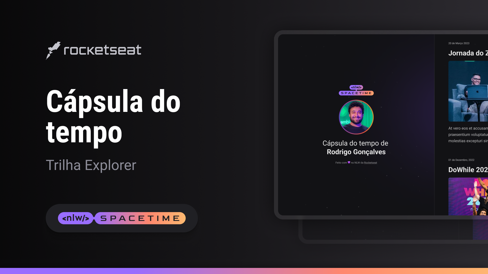

## 👨‍💻 [Projeto NLW Spacetime](https://krat-s.github.io/NLW-SpaceTime/) 👨‍💻

Esse é um projeto Web responsívo de uma capsula do tempo para exibir memórias em uma linha do tempo.

## 🚀 Tecnologias

Esse projeto foi desenvolvido durante o NLW da Rocketseat com as seguintes tecnologias:
-HTM
-CSS
-Git e Github

## 🏷️ Layout

Você pode visualizar o Layout do projeto através [desse link](<https://www.figma.com/file/kcz1zvAbVycu4J5W6omdmq/C%C3%A1psula-do-tempo-%E2%80%A2-Trilha-Explorer-(Community)-(Kratos)?type=design&node-id=352%3A8&t=7mk2w9djYEhfNXAY-1>).
É necessário ter uma conta no [Figma](https://www.figma.com)
